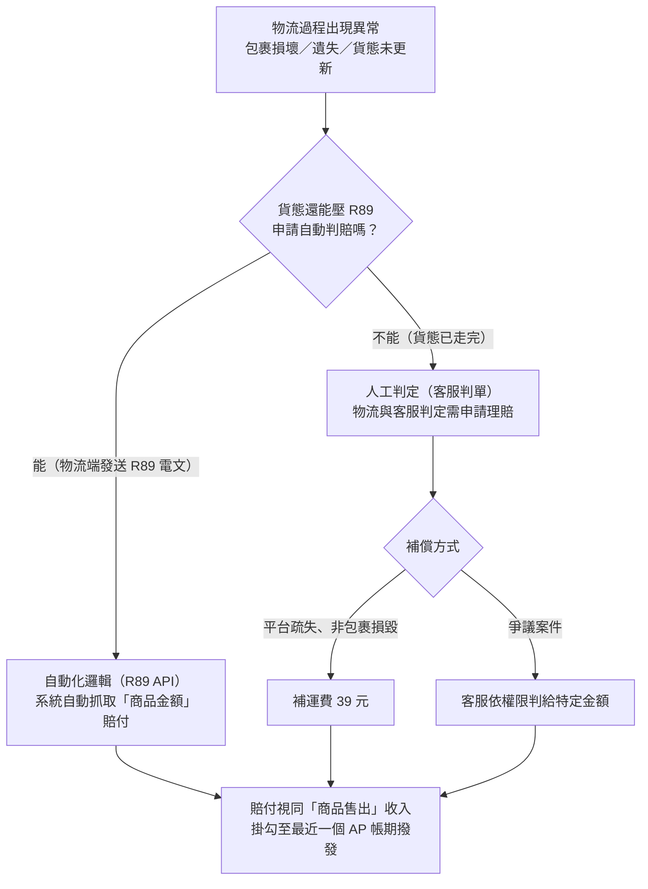

# 商品賠款與異常退款機制

完成標準交易結算後，若物流過程出現包裹損壞或遺失等異常，系統將進入「賠款與退款」處理流程。

平台針對包裹異常設有自動化 API 偵測與人工判單機制，核心邏輯在於補償賣家的「商品價值」。

## 異常處理機制

### 自動化邏輯（R89 API）

- **觸發條件：** 物流端主動發送 R89 電文（物流回傳異常代碼，如毀損或確認遺失）。
- **補償範圍：** 系統自動抓取「商品金額」進行賠付，並主動排入當期應匯款項。

### 人工判定（客服判單）

適用情境：貨態已走完無法再壓 R89 申請自動判賠，且物流與客服已判定該訂單需要申請理賠。

**常見申請情境：**

1. 取貨後，買賣家反應包裹損毀，與物流確認願意認賠/全家認賠
2. 包裹遺失，但實際價值與訂單金額不同，物流或全網因客情願意個案理賠實際金額
3. 買家已完成取件，但好賣＋貨態沒有更新，故無法正常匯款，需走人工匯款

**補償方式：**

- **補運費：** 針對非包裹損毀、但屬平台疏失之案件，客服可手動觸發僅賠償 39 元運費。
- **特定金額賠償：** 針對爭議案件，客服可依權限判給特定金額（如部分或全額賠償）。

## 財務歸屬

在賠付流程中，**運費通常不予賠償**。平台認定物流服務已啟動，故運費仍需正常扣除並開立發票。

賠付金額將視同「商品售出」之收入，掛勾至最近一個 AP 帳期進行撥發。

**特殊情況：** 當賣家使用宅配等缺乏「代收貨款」作為抵銷手段的服務時，系統將觸發另一套依賴信用卡的「補扣機制」，詳見[信用卡補扣機制](./credit-card)。
