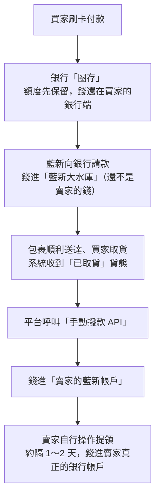
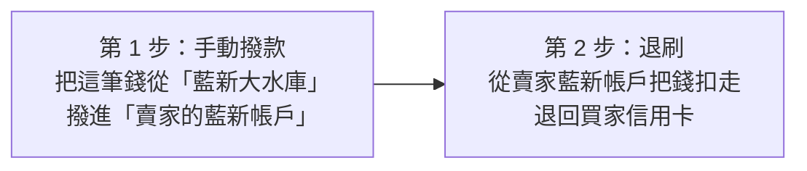
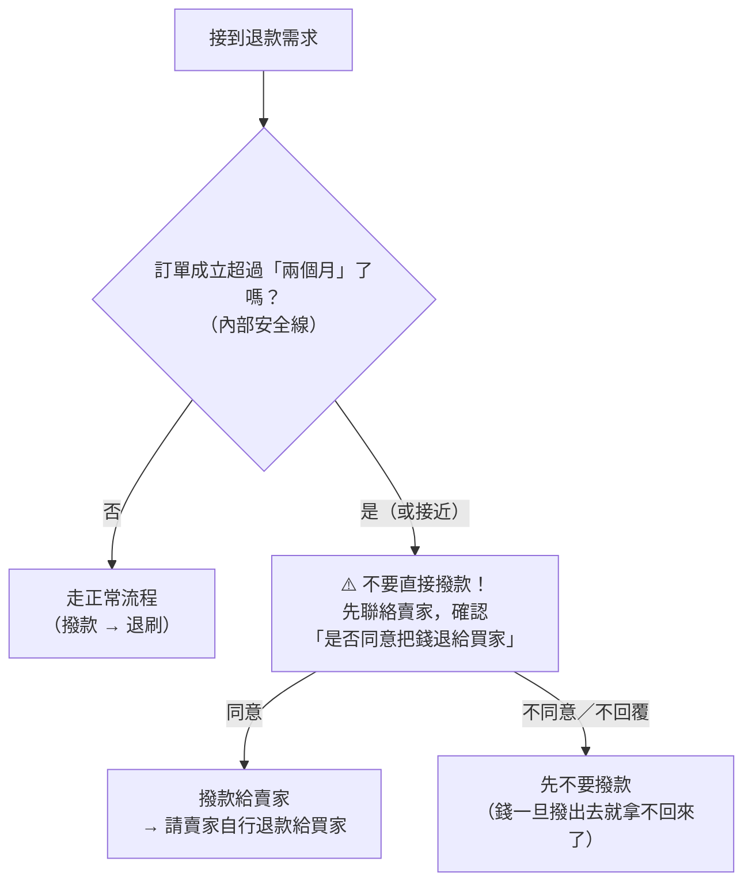

# 信用卡金流、退刷與 60 天自動取消機制

本頁說明買家以**信用卡**付款時的金流路徑、退款（退刷）運作原理與限制，以及為避免超過退刷期限而設計的「60 天未出貨自動取消」機制。

> 💡 **提醒**：本頁的「信用卡機制」指買家付款金流；賣家宅配運費的信用卡**補扣**是另一套機制，請見[信用卡補扣機制](./credit-card)。本頁提到的「賣家的藍新帳戶」是如何申請、綁定的，請見[藍新帳戶機制](./newebpay-account)。

## 一、信用卡金流（正常流程）

:::info[重點觀念]
平台採「**手動撥款**」模式：一定要等到系統收到「**買家已取貨**」的貨態，平台才下指令撥錢給賣家。這是保護買家的設計：**買家沒拿到貨，賣家就拿不到錢**。
:::

## 二、退刷的運作原理

退刷（把款項退回買家信用卡）必須分兩步執行：

**為什麼要先撥款？** 因為退刷的規則是「**帳戶裡要有錢才能退**」。錢還躺在大水庫時，不能直接退給買家——第三方（藍新）不會幫忙墊錢。所以不管誰刷卡、退給誰，都得先讓賣家帳戶有這筆錢，再從那裡退。

## 三、退刷的三大限制

### 1. 期限：規格上三個月（90 天）

- 平台對外（FAQ、給買賣家的說法）一律講「**兩個月**」，保留一個月當緩衝。
- 起算日其實沒有明確定義（訂單成立 vs 實際刷卡，差距通常不到一天，因為信用卡訂單成立後 15 分鐘內就會刷卡）。
- 超過期限 → 退刷 API 會失敗，只能請賣家自行退款給買家。

### 2. 藍新的「轉檔時段」：早上 6 點～9 點不要退刷

:::warning
早上 6～9 點是藍新系統轉檔／維護的時段，操作可能出現「**看起來失敗、其實成功**」的狀況。

**真實案例**：撥款時顯示失敗 → 隔天重試 → 才發現前一天其實已成功、錢已被 D+1 自動轉走 → 退刷卡住。

**結論**：所有人工退刷都已改成避開這個時段；未來系統自動退刷也要排在凌晨批次執行。
:::

### 3. 信用卡 R89 目前沒有真正自動化

R89 判賠機制（見[賠款與異常退款](./claims)）是平台還沒開信用卡付款時建的。「信用卡＋包裹遺失」半年來第一次發生，才發現退刷這段沒有動起來。目前退刷失敗**不會留 log、不會通知任何人**，只能請工程（Alan）去查——這是後續要改的。

## 四、客服 SOP：超過（或接近）退刷期限怎麼辦？

**為什麼一定要先問？** 因為「撥款」是退刷無法跳過的前置步驟；退刷若失敗，錢已在賣家帳上，平台管不到了。以前處理過期案件的做法就是：**先取得賣家同意，才撥款**。

## 五、「60 天未出貨自動取消」機制

- **僅適用信用卡訂單**：訂單成立後 60 天仍未出貨，系統會自動取消訂單，並將款項退回原信用卡，買家不需另外申請。
- **目的**：避免訂單一直不出貨、拖過退刷期限，導致買家的錢退不回卡片，所以系統會趕在期限前主動取消並退款。
- **適用所有物流方式**（店到店、宅配、未來即將上線的社區取）。
- 其他付款方式（如取貨付款）**不會**被自動取消，僅信用卡保留此機制。

### 各物流方式的取消與退寄處理

| 情境 | 宅配 | 店到店 |
| --- | --- | --- |
| **取消訂單（未取得寄件編號）** | 60 天內可由系統自動取消 | 60 天內可由系統自動取消 |
| **取消訂單（已取得寄件編號）** | 需通知客服**人工取消** | 60 天內仍可由系統自動取消 |
| **包裹退寄** | 無人收件退寄：自動退刷 | 買家未取退寄：由系統自動取消 |

> 💡 **提醒**：宅配自動取消可能遇到向 Tapay 要回應失敗、需人工取消的狀況。開發已調整成**離峰時段**打 API，但仍有小機率失敗，屆時還是要靠人工取消。宅配退寄的自動退刷已涵蓋大部分情境（未收退回、貨損等），少數特殊情境仍可能需要人工處理。
