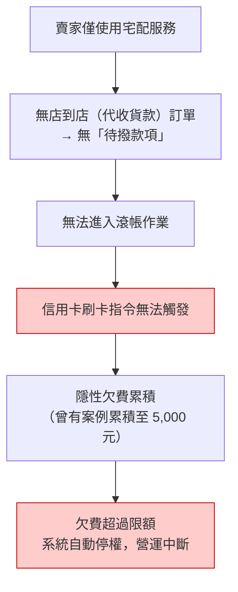

# 信用卡綁定與運費自動補扣機制

當賣家開啟「宅配」功能時，因款項直接進入賣家信用卡帳戶，平台無法從代收端扣抵運費，故**強制要求綁定信用卡**作為風險控管手段。

## 現行邏輯缺陷與風控警告

:::danger[關鍵風險警示]
現行「信用卡自動扣款」是與「滾帳 (Rolling Account)」流程掛勾。若賣家**僅使用宅配服務**，且無任何店到店（代收貨款）訂單，系統會因該賣家無「待撥款項」而無法進入滾帳作業，進而**導致信用卡刷卡指令無法觸發**。
:::

此缺陷將導致以下連鎖反應：

1. **隱性欠費累積：** 運費債務會持續在後台累積，曾有案例累積至 5,000 元後才被發現。
2. **系統性停權：** 當欠費累積超過限額，系統將自動將賣家帳號停權，導致營運中斷。

> 💡 **提醒**：買家信用卡付款的金流與退款（退刷）機制，請見[信用卡金流與退刷機制](./credit-card-refund)。
