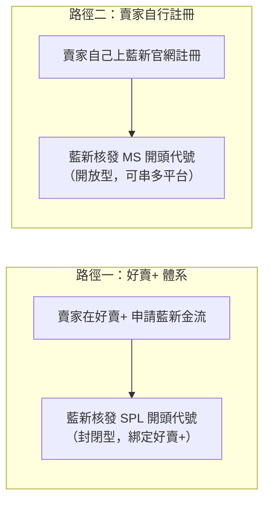
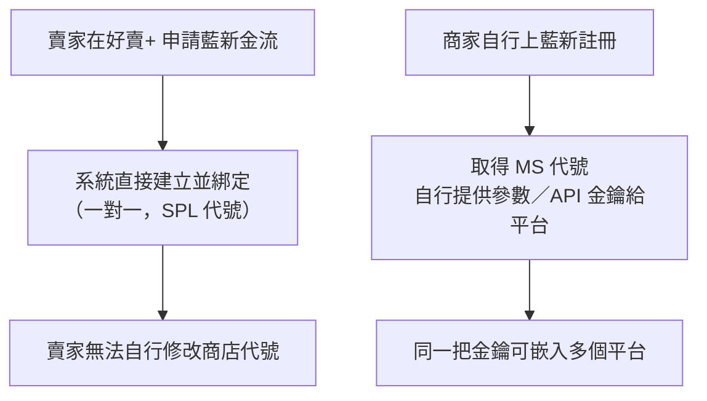

# 藍新帳戶機制：SPL 與 MS 兩條路徑

藍新科技（NewebPay）本身是**開放平台**——任何人都可以直接從藍新官網註冊帳戶，不需要透過任何平台。因此同一位賣家可能同時存在兩種身分，代號體系完全不同。

> 💡 **提醒**：本頁說明的是藍新「帳戶／代號」層級的申請與綁定架構，屬於[信用卡金流與退刷機制](./credit-card-refund)、[信用卡補扣機制](./credit-card)背後的帳戶基礎；買家刷卡後款項如何流轉、退刷限制，請見前述兩頁。

## 兩條註冊路徑

| 路徑 | 代號開頭 | 特性 |
| --- | --- | --- |
| 好賣+ 體系申請 | **SPL** | 封閉型，綁定好賣+ |
| 賣家自行上藍新官網註冊 | **MS** | 開放型，可同時串接多個平台 |

## 開放型平台如何串金流（Shopline、CYBERBIZ 模式）

市面上其他電商平台（如 **Shopline、CYBERBIZ** 這類）多是叫商家**自己去藍新註冊帳號**，串接方式如下：

1. 商家自行到藍新官網註冊帳號。
2. 註冊完成後，商家把藍新後台「商店設定」裡的**參數（串接資訊）**提供給平台。
3. 較進階的做法是走 **API 金鑰管理**：藍新提供 API 金鑰，商家把金鑰貼到平台，平台就能與這個藍新帳戶**通連**。
4. 這種**開放型金鑰的特性是「可以嵌入不同平台」**——同一把金鑰可以貼到各個平台使用，一家商店的藍新帳戶能同時服務多個通路。

## 好賣+ 的封閉式設計：一對一、申請即綁定

好賣+ 走的是完全不同的路：

- 好賣+ 的金流介接**單純、介接對象沒那麼多**，採**封閉式**設計。
- 賣家在好賣+ 申請藍新金流時，**系統直接建立並綁定**——一對一，**不需要賣家去填任何金鑰**。
- 換句話說：好賣+ 後台的藍新商店代號是申請當下就綁死的，賣家**無法自行修改**。

:::info[為什麼封閉型有價值？]
SPL 體系內含三件開放型（MS）沒有的東西：

1. **好賣+ 與藍新雙方的簽約關係**
2. **分潤機制**（平台從交易中抽成）
3. **平台認證**——出問題時平台有立場、有能力處理
:::
