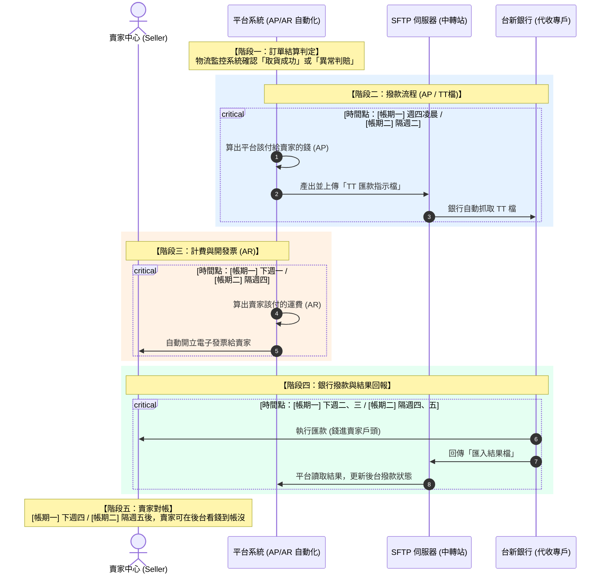

# 全週期帳務時程與系統處理流程

平台透過自動化拋檔，將每週交易拆分為兩大帳期，並產出 TT 檔透過 SFTP 與銀行端（台新銀行）對接。

## 系統層級與拋檔說明

- **AP（Accounts Payable，應付帳款）：** 公司「應該付給別人的錢」，即平台把代收貨款撥款給賣家。AP 檔由系統於特定時點偵測「最終貨態」訂單後產生，並上傳至 SFTP 由財務端抓取進行撥款。

- **AR（Accounts Receivable，應收帳款）：** 公司「應該向別人收取的錢」，即平台向賣家收取的運費。AR 檔針對該期「運費」開立發票給賣家。

## 雙軌帳務時間表

| 階段 | 動作說明 | 系統節點 | 帳期一（週一至週三訂單） | 帳期二（週四至週日訂單） |
| --- | --- | --- | --- | --- |
| **結算觸發** | 判定最終貨態（取貨/異常判賠） | 平台物流監控系統 | 週一至週三（已寄件訂單） | 週四至週日（已寄件訂單） |
| **產生支付檔** | 產生 AP 檔並拋送至 SFTP 與台新銀行對接 | AP 自動化系統（TT 檔） | 週四凌晨（出支付檔） | 隔週二（出支付檔） |
| **開立發票** | 針對運費產生 AR 檔並開發票 | AR 自動化系統 | 下週一（開立發票） | 隔週四（開立發票） |
| **執行匯款** | 銀行執行代收專戶撥款 | 銀行對接系統（台新） | 下週二（匯款） | 隔週四（匯款） |
| **結果回報** | 匯入匯款成功/失敗結果 | SFTP 檔案回報 | 下週三（匯入結果檔） | 隔週五（匯入結果檔） |
| **賣家對帳** | 賣家可於後台查詢撥款狀態 | 賣家中心後台 | **下週四** | **隔週五後** |

## 流程時序圖

