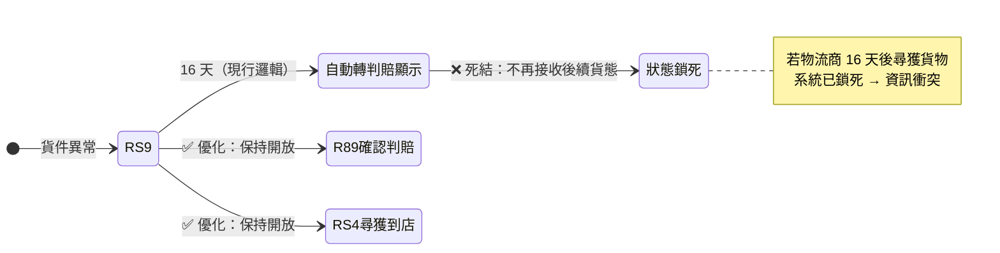

# 物流異常與系統邏輯優化建議

## 冷凍 C2C 容載邏輯失效分析

- **現狀痛點：** 系統雖在買家「選擇店舖」時透過 API 檢查冰箱容載，但由於「好賣家」平台提供「延期寄件」功能，買家選店時的容載數據與賣家實際寄件時的空間狀況存在嚴重時間差。
- **優化方向：** 建議重新評估預約邏輯，或在賣家「取號」階段進行二次容載驗證，而非僅依賴初次選店數據。
- **流程差異補充：** 冷凍系統與一般物流流程不同，地圖選擇與空間預留邏輯有差異；且好賣+ 專案可**延長取件編號時間**，流程設計與原本系統不同。

---

## RS9（貨件異常）處理邏輯優化

- **死結問題：** 目前系統對 RS9 設有「16 天自動轉判賠」之顯示邏輯，但這並非最終貨態。若物流商在 16 天後尋獲貨物，系統卻已鎖死狀態，將導致資訊衝突。

**優化建議：**

1. **狀態解鎖：** 系統必須保持開放性，即便觸發 16 天 RS9 提醒，仍應允許接收後續的 R89（確認判賠）或 RS4（尋獲到店）狀態更新。
2. **文字修正：** 前台應取消「自動判賠」字眼，改為「貨件異常追蹤中，請聯繫客服人工確認」，以降低誤導。
3. **數據深度：** 客服後台應呈現完整 Error Code，並建立標準化流程：客服須進入「日翊物流系統」核對最原始之貨態日誌，而非僅依賴 API 轉發後的簡化資訊。

---

## 閉轉店 API 代碼對應驗證

- **邏輯錯誤：** 發現物流商回傳「閉轉店」API 時，買家 (0) 與賣家 (1) 的代碼定義偶有翻轉錯誤，導致通知發送對象錯誤。
- **優化建議：** 技術端應針對日翊回傳之 Value 建立代碼對應的驗證機制，收集異常案例要求物流商修正規格，確保閉轉店通知之精準度。

---

## 總結

「好賣家」平台的財務與營運穩健，取決於：

1. **維運費用轉折期的精準對帳**（115 年 6 月之 30 萬調整）
2. **物流異常處理的透明化**

透過修正冷凍 C2C 的預約衝突與 RS9 的自動化誤判，方能有效提升平台誠信度並降低客服人力損耗。
