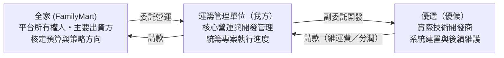

# 「好賣家」維運合約財務分析與物流運作

## 合約主體與三方關係

「好賣家」平台的合作關係由以下三方構成：

| 角色 | 說明 |
| --- | --- |
| **全家 (FamilyMart)** | 平台所有權人與主要出資方，負責核定預算、策略方向與最終投資損益。 |
| **運籌管理單位（我方）** | 核心營運與開發管理方，負責對全家請款並統籌專案執行進度。 |
| **優選（優候）** | 實際技術開發商，接受我方副委託執行系統建置與後續維護。 |



## 「以維運養開發」的財務邏輯

本專案初期採取「開發合約不直接支付現金」之模式，將系統建置成本攤提至後續的「維運合約」中分期支付。

- **初期開發：** 合約中未載明具體開發費用，實質成本透過固定月費支應。
- **追加功能（專案約）：** 針對後續功能追趕（如首頁改版 150 萬與 118 萬等），則採獨立專案合約簽署。其支付邏輯通常包含「一次性驗收款」與後續「年度/月度追加維護費」。
- **預算影響：** 這種模式雖降低了啟動門檻，但導致維運費用隨專案堆疊而逐年增加，需精確掌握「隔年同月」或「隔年度」起算的維護費轉點。

---

## 合約清單

合約層級結構：主約 → 增補 → 專案項目（運費變價）。

:::info[第一次申請需附合約]
若是當月份**第一次申請的新增費用**，請款時需附上相對應的合約。
:::

| 合約 | 文號 / 日期 |
| --- | --- |
| 客製主約：合約簽呈 (New) | COVE240500033（2025/04/07） |
| 主約：優選互動科技股份有限公司 好賣+平台維運合作合約書 | COVE230800027（2025/04/07） |
| 維運約：好賣+平台網站客製化服務及維運合約書（首頁改版 + 9 項功能追趕） | COVE240500033（2025/05/29） |
| 客製化增補：好賣+平台網站客製化服務及維運合約書 增補協議書 | COVE241200002（2025/04/07） |
| 專案開發：依 113 年開口合約執行「平台運費變價機制」開發作業文件用印 | COVE250700010（2025/10/27） |

紙本合約管理路徑：

```
J:\09、公文管理\09-1、合約管理\112年合約\好賣+\
COVE230800027 優選互動科技股份有限公司 好賣+平台維運合作合約書
```
