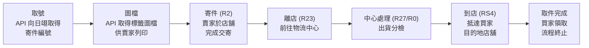
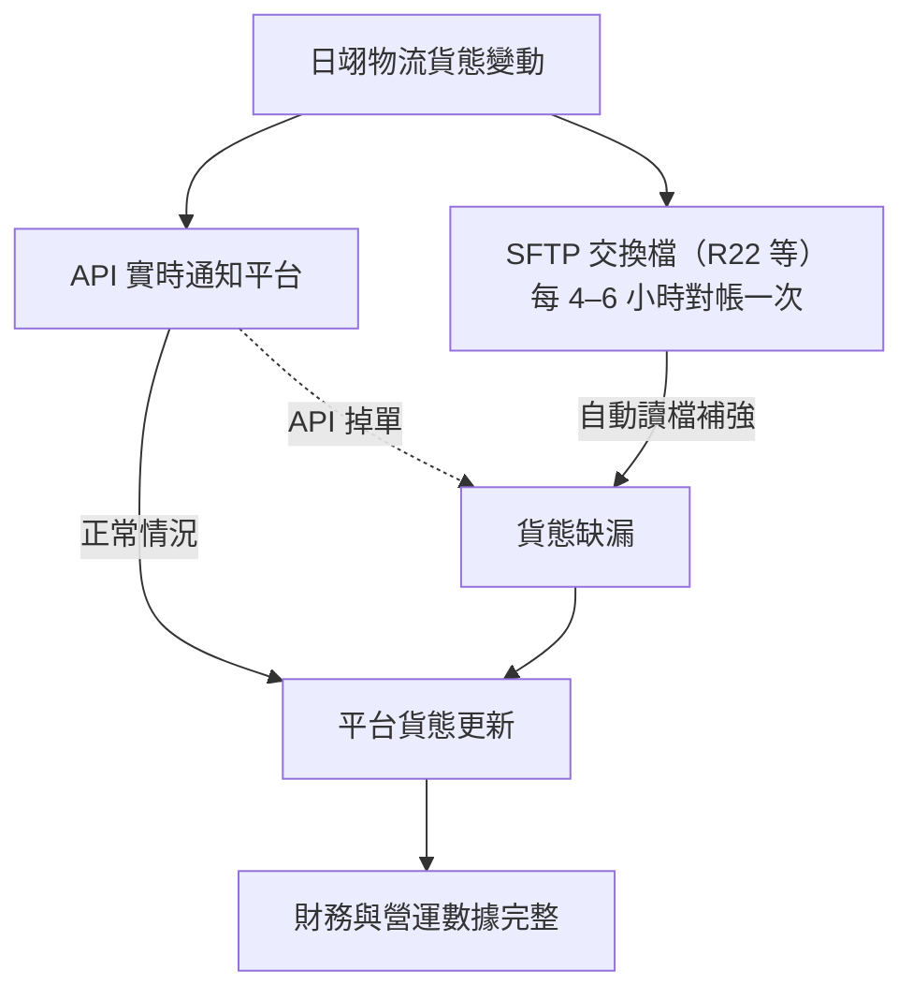

# 物流生命週期與 API 運作邏輯

物流數據的準確性由 API 實時通知與 SFTP 補檔機制共同保障，這是支撐財務對帳數據來源的技術骨幹。

## 訂單生命週期路徑

| 階段 | 貨態代碼 | 說明 |
| --- | --- | --- |
| **取號** | — | 訂單成立後，API 向日翊物流取得「寄件編號」。 |
| **圖檔** | — | 呼叫 API 取得標籤圖檔供賣家列印。 |
| **寄件** | R2 | 賣家於店舖完成交寄，系統接收 R2 狀態。 |
| **離店** | R23 | 貨件離開交寄店舖前往物流中心。 |
| **中心處理** | R27 / R0 | 貨件抵達物流中心並執行出貨分檢。 |
| **到店** | RS4 | 貨件抵達買家指定之目的地店舖。 |
| **取件完成** | — | 買家領取，流程終止。 |

> 💡 **提醒**：取得寄件編號後，訂單即進入正式流程，買家無法單方面取消。寄件編號效期為 **14 天**，若賣家未於 14 天內出貨，寄件編號將失效，失效後可取消訂單或重新申請。

## 容錯與同步機制（API + SFTP 雙軌）

為應對 API 掉單風險，系統設有每 **4–6 小時**運作一次的 **SFTP 檔案對帳機制**。系統會自動讀取 R22 等交換檔，針對 API 未能即時更新的貨態進行補強，確保財務與營運數據的完整性。

