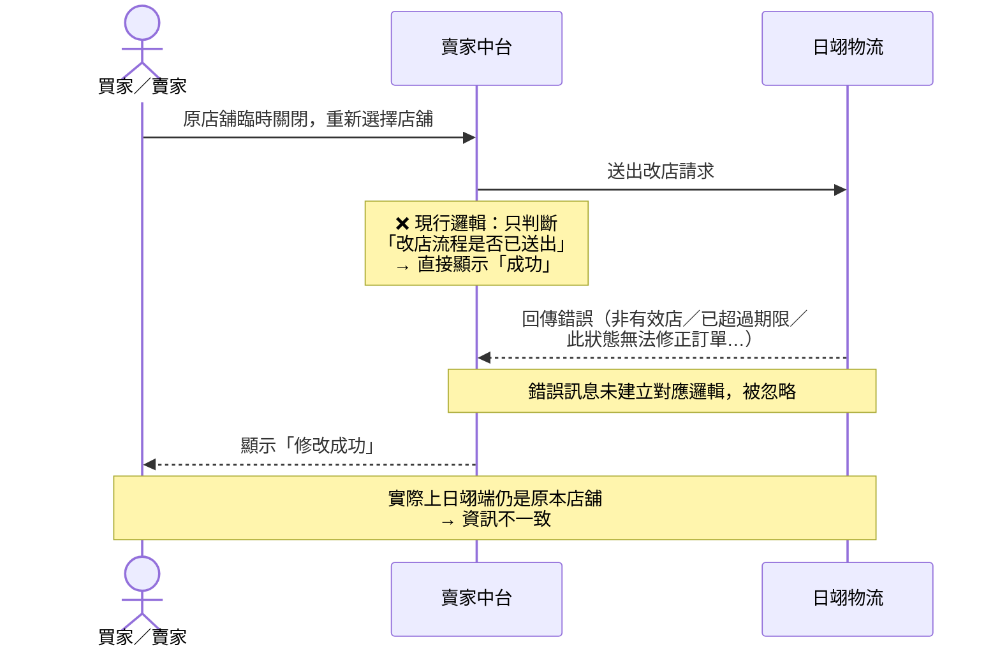

# 閉轉店 API：改店成功但實際修改失敗

**問題描述：**

用戶反饋「因原指定店鋪臨時關閉，重新選擇店鋪後實際更改失敗，系統卻仍顯示成功」。

主要原因為現行系統邏輯僅判斷「改店流程是否已送出」，而未完整依據物流端回傳的錯誤訊息進行對應的狀態轉換。

## 問題根因

閉轉店流程中，有部分訂單實際修改店舖失敗，但賣家中台仍顯示處理成功。

目前賣家中台顯示成功，主要是因現行系統判斷邏輯偏向「閉轉通知或改店流程是否已送出」，但尚未完整依據日翊回傳的各類錯誤訊息，進一步轉換成對應的失敗狀態或提示文案。

**日翊實際回傳的結果可能是：**
- 非有效店
- 已超過期限
- 此狀態無法修正訂單
- 已透過其他管道更改店舖

但系統未針對這些錯誤訊息建立完整對應邏輯，導致賣家中台顯示修改新店舖成功，但日翊端仍是原本店舖，造成資訊不一致。

---

## 新版閉轉店 API 回傳訊息代碼

| 代碼 | 說明 |
| --- | --- |
| `000` | 成功 |
| `035` | 已超過 7 天不可異動店舖資訊 |
| `036` | 資料傳輸逾期 |
| `100` | 查無資料 |
| `999` | 可能包含多種情境：已更改店舖、此狀態無法修正訂單、非有效店或寫入資料錯誤等 |

詳細 Excel 內容請參考信件附件：

