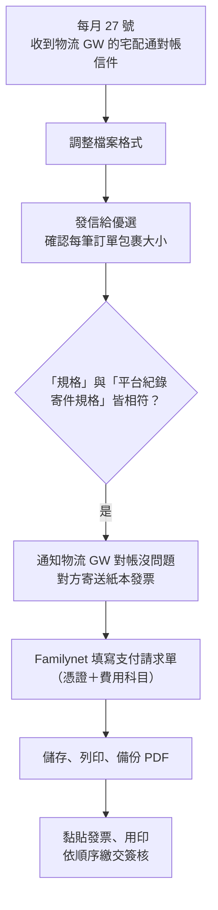

# 每月宅配通訂單內容確認

## 全流程總覽



## 流程步驟

**步驟一：收取對帳信件**

每月 27 號會收到由物流 GW 負責 PM 發來的宅配通對帳信件，主旨格式：`202605_全網請款明細`。


---

**步驟二：調整格式**

收到後需調整格式，檔案參考處：

```
平台企劃T\00_共用資料夾\A_02_專案管制總表\請款資料\00_115年\11506
```


---

**步驟三：發信給優選確認**

格式調整完成後，發信給優選確認每筆訂單的包裹大小是否正確。

- 需要將**總額欄位刪除**，並加入黃底欄位供優選回覆
- 範例信件主旨：`Re: 【好賣+】請協助提供平台5月份宅配訂單規格`


---

**步驟四：確認規格後回覆物流 GW**

待優選回覆後，查看檔案中的「規格」與「平台紀錄寄件規格」是否皆符合。若皆符合，通知物流 GW 負責 PM 對帳內容沒問題，對方就會發紙本發票影本信件和寄送紙本發票。

---

**步驟五：Familynet 填寫支付請求單**

- 支付請求單（一萬五以下授權經理）
- 支付類型：一般支付
- 對象代號：**163004**
- 付款方式：匯款
- 勾選**內扣匯費**
- 需款日期：週二、週五、15 日、30/31 日（可設定下一週的日期，例如 6/9 申請可押 6/16，確保跑完簽核流程後不延遲撥款時間）
- 說明：當年度月份 + 宅配運費（好賣+），範例：`11410宅配運費(好賣+)`


---

**步驟六：填寫憑證資訊**

- 憑證區分：進項
- 憑證類別：電子發票
- 聯式：三聯
- 發票號碼：輸入紙本發票號碼（直接填英文+數字，不用 `-` dash）
- 憑證日期：輸入紙本發票開立日期
- 統一編號：**70624227**
- 費用區分：進貨及費用
- 課稅別：應稅
- 扣抵代號：直接折抵
- 未稅金額：輸入未稅金額（稅額與合計金額系統自動計算）


---

**步驟七：費用科目**

- 責任單位：**M1OO 數位部**
- 科目代號：**2930**


---

**步驟八：儲存並列印**

支付單【編輯】後，點擊線上【儲存】後，選擇【是】列印，去印表機列印。

也可到「支付作業 / AP.1.2.3 支付請求單列印」另存 PDF，放到檔案路徑：

```
平台企劃T\00_共用資料夾\A_02_專案管制總表\請款資料\00_115年\11506
```

檔案重新命名為：`好賣+宅配運費11506_支付單`


---

## 支付單檔案繳交簽核順序

1. 全網行銷公司支付請求單（正面黏貼正本紙本發票，經辦人欄位須用印＋日期，因一萬五以下授權經理，所以要蓋在上一層協理那裡）
2. 台灣宅配通股份有限公司 115 年 05 月份 對帳單
3. 月結客戶請款明細表（用印）
4. 影本發票
