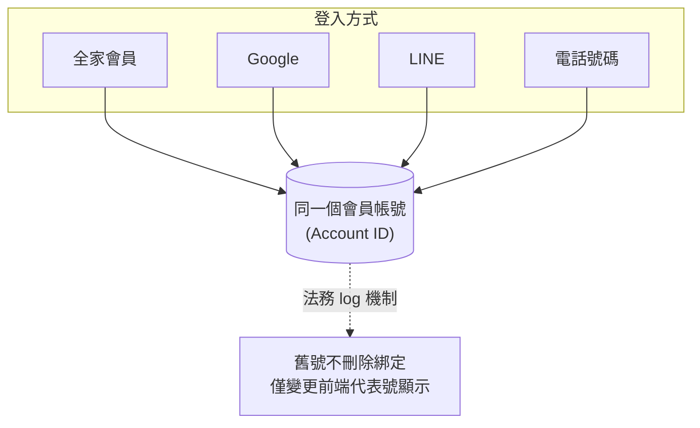
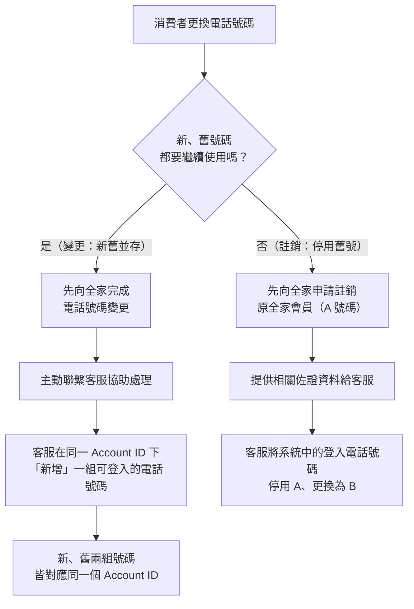

# 平台帳號綁定機制

## 核心原則

- 目前平台系統支援的第三方登入方式（**全家會員、Google、LINE、電話號碼**等），不論使用哪一種登入方式，皆會綁定至**同一個會員帳號（Account ID）**。
- 系統因長期的**法務 log 機制**，定案**舊號不會刪除與 Account ID 的綁定**，僅處理前端的「代表號」顯示。

## 消費者變更或註銷電話號碼的處理方式

### 一、變更電話號碼（新、舊號碼皆需保留）

若消費者更換全家會員所使用的電話號碼，但希望新、舊電話號碼都能繼續使用：

1. 消費者需先向全家完成電話號碼變更。
2. 由於系統仍會保留原有資料，消費者需**主動聯繫客服**協助處理。
3. 客服處理方式並非修改原帳號，而是在**同一個會員帳號下新增一組可登入的電話號碼**。
4. 因此，新、舊兩組電話號碼皆會對應至同一個會員帳號（Account ID）。

### 二、註銷舊電話號碼（停用舊號碼並改用新號碼）

若消費者希望停用舊的全家會員電話號碼，改綁定新的電話號碼：

1. 消費者須先向全家申請**註銷原全家會員**（A 電話號碼）。
2. 完成註銷後，提供相關佐證資料給客服。
3. 客服再協助將系統中的登入電話號碼**停用 A、更換為 B**。
