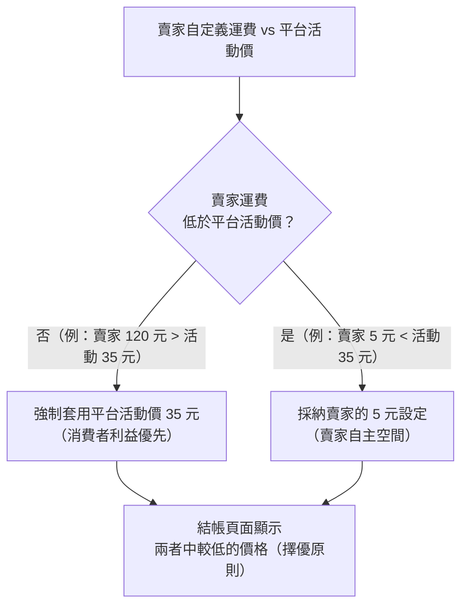

# 商品、賣場與系統運費的衝突處理

在高度彈性的系統中，賣家自定義運費與平台政策可能產生不一致。系統透過「擇優原則」強制執行一致性，以確保消費者體驗與平台競爭力。

## 衝突情境與處理原則

- **平台優惠強制套用：** 若賣家在商品頁設定 120 元運費，但平台正進行補貼活動（活動價 35 元），系統會強制套用 35 元。此為「**消費者利益優先**」原則。
- **低價優先原則：** 若賣家自定義運費「低於」平台活動價（如賣家設 5 元，平台活動 35 元），系統將採納賣家的 5 元設定，給予賣家自主空間。
- **「下期生效」機制：** 賣家若欲調整「自動套用平台優惠」之開關，需注意規則可能在「下期活動循環」才生效，以防止既有訂單在處理中產生帳務衝突。

## 核心原則總結

| 原則 | 說明 |
| --- | --- |
| **消費者利益優先** | 確保買家在結帳頁面看到的是平台對外宣稱的最優價格。 |
| **賣家自主調控空間** | 在不損及市場定價權的前提下，容許 C2C 賣家針對特定高價值或重物商品調整運費（需高於平台活動價方會顯示）。 |
