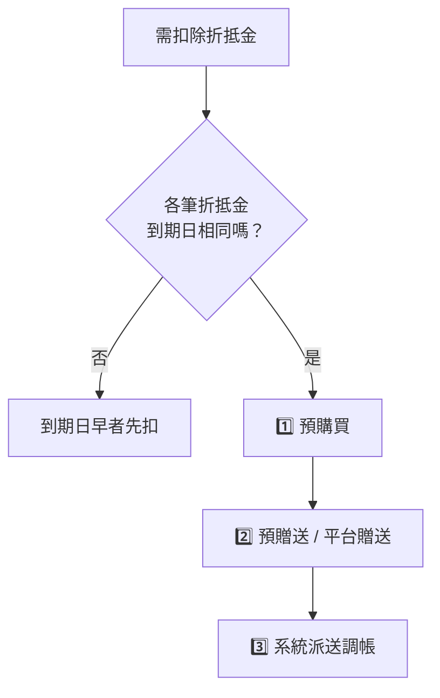

# 運費折抵金（折扣金）的來源與扣除規則

「運費折抵金」是調節賣家與物流商「日翊」之間結算成本的關鍵載體，折抵金在帳務上呈現「**總額抵銷**」而非「單一訂單對應」。

## 折抵金四大來源

| 來源類型 | 說明 |
| --- | --- |
| **預購買** | 賣家付費儲值（如買 10,000 送 3,000）。 |
| **預贈送 / 平台贈送** | 參加行銷活動或「運費大禮包」獲得的回饋。 |
| **系統派送調帳** | 針對爭議訂單或特殊補償之手動調帳。 |

## 扣除優先順序

系統採自動化扣款，優先順序如下：

1. **到期日早者先扣**
2. 到期日相同時，扣款順序為：**預購買** → **預贈送 / 平台贈送** → **系統派送調帳**



## 帳期與結算公式

平台維持「一週撥款兩次」的帳期制度：

```
最終撥款額 = 總代收金額 - (物流原價 - 折抵金)
```

> **注意：** 運費折抵金並非即時扣抵，而是採「帳期制」。訂單撥款時會先扣除原始運費，折抵金則是在該帳期結算時補回。

## 折抵金活動的刪除規則

平台折抵金活動若需刪除或清空折抵金，依活動狀態走不同途徑：

| 活動狀態 | 處理方式 |
| --- | --- |
| **尚未開始** | 可直接手動進後台刪除 |
| **已開始或已結束** | 需清空折抵金時，需**發信請優選協助刪除** |
