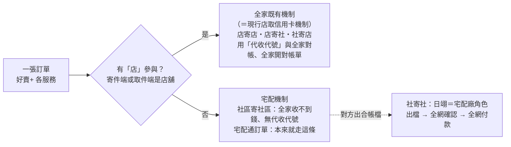
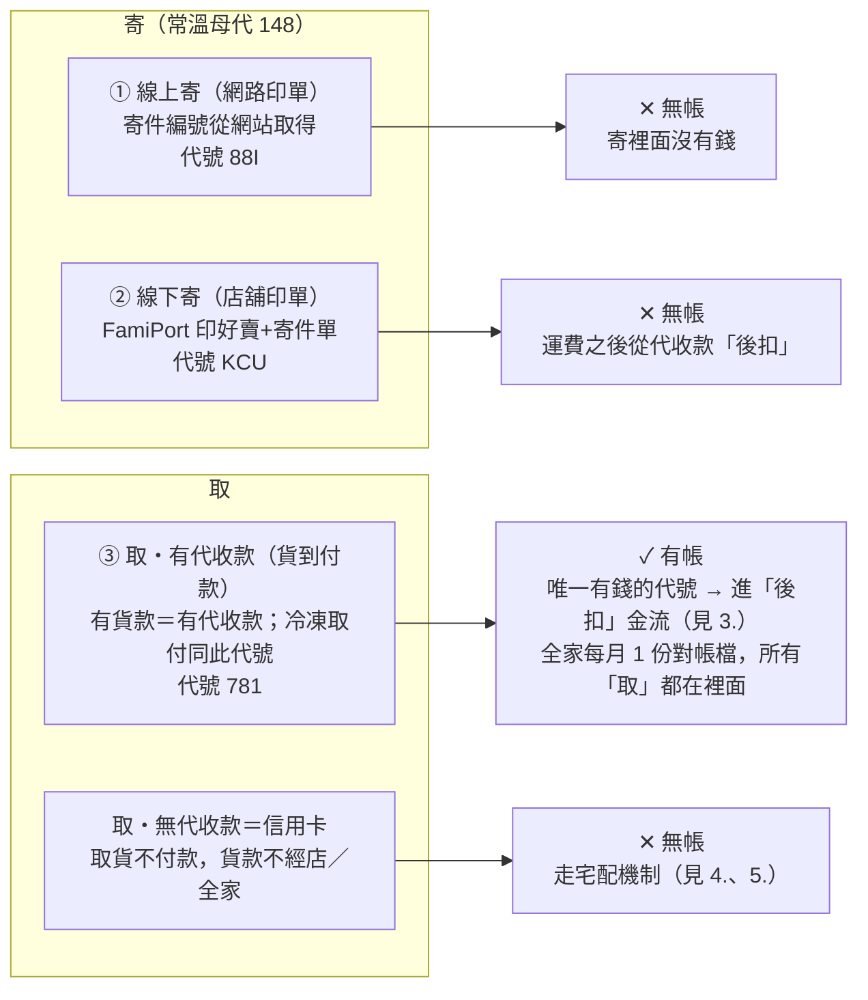
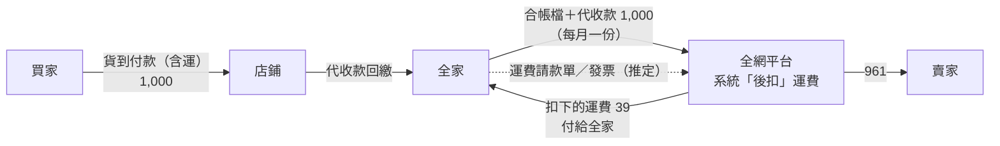
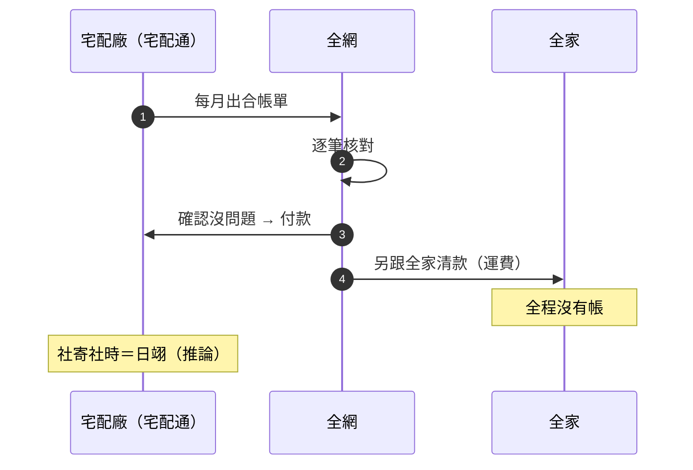
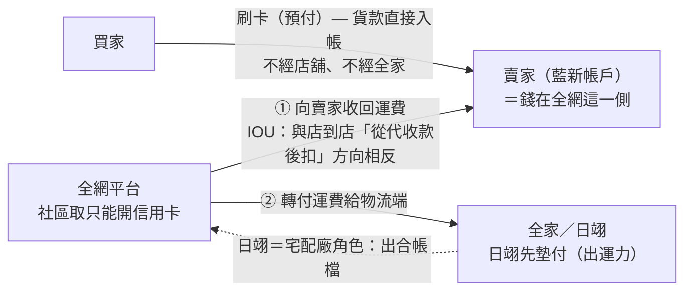

# 代收代號與貨款動線

依 2026/09/03 內部討論（Ken 主講）＋ ken 手繪圖 ＋ 日翊怡亭代收代號資料整理。標「推定」「待確認」者尚未定案，引用前請先核實。

---

## 1. 總判準：訂單走哪一條核帳路

會末收斂的「final answer」：看訂單有沒有「店」參與。**有店走全家既有體系；完全沒有店就走宅配機制，由對方出合帳檔。**

**核帳路線判準**：「只要有店的，走全家的（現行店取信用卡機制）；沒有經過店的，就走宅配機制」。社寄社由日翊擔任宅配廠角色出合帳檔——此環節為會中推論，尚待三方共識。

| 訂單型態 | 有店參與 | 走哪條 | 誰出帳 |
| --- | --- | --- | --- |
| 店寄店 | ✅ | 全家既有機制 | 全家開對帳單 |
| 店寄社 | ✅（寄件端） | 全家既有機制 | 全家開對帳單 |
| 社寄店 | ✅（取件端） | 全家既有機制 | 全家開對帳單 |
| 社寄社 | ❌ | 宅配機制 | 日翊出合帳檔（待定） |
| 宅配通訂單 | ❌ | 宅配機制 | 宅配通出合帳單 |

---

## 2. 常溫架構：寄 × 取 × 有無代收款（＝ken 手繪圖）

三個代收代號中，**只有「取・有代收款」這條路有錢**；全家每月也只出一份對帳檔，所有「取」都在裡面。

**即 ken 手繪圖上半部**：寄（上＝線上、下＝線下）皆無帳，取分有／無代收款，「信」（信用卡）指向無代收款。有帳的只有取件店代號 **781**。

> ⚠️ **「退回寄件店」情境用的代收代號已確認是錯的（錯了多年）**，新代號待全家（玟瑩）提供後交 Alan 設定。

---

## 3. 取貨付款金流：代收款與運費「後扣」

錢只以「貨款」一包進來，**運費是撥款當下在我們系統裡扣的**——所以全家不需要另外給運費的帳，「寄」的代號也就沒有帳。

例取自錄音：收到代收款 1,000 → 扣運費 39 → **961 撥賣家、39 給全家**。要分開梳理的是「代收款動向」與「運費動向」兩條線。

| 兩條動線 | 錢的方向 | 帳的來源 |
| --- | --- | --- |
| 代收款 | 買家 → 店鋪 → 全家 → 全網 → 賣家 | 全家每月合帳檔（取件節） |
| 運費 | 從代收款中「後扣」，全網 → 全家 | 全家運費請款單／發票（推定） |

綠色路徑（貨款）為錢的實際流向；因運費是平台從代收款扣回去給全家的，**全家端不會、也不需要出現「寄」的帳**。

---

## 4. 宅配機制：對方出帳、全網付款、再與全家清款

信用卡（取貨不付款）走的就是這條：**全家全程沒有帳，由宅配廠出合帳單。**

順序 ①→④ 為真實作業順序：**先收帳、核對、付款，最後才與全家結清運費相關款項。**

**與 3. 的差別在「誰先出帳」：**

| 比較項目 | 店寄體系（圖 3） | 宅配體系（圖 4） |
| --- | --- | --- |
| 誰先出帳 | 全家給檔、給錢 | 廠商（宅配通／日翊）請款 |
| 錢的方向 | 全家 → 全網 → 賣家 | 全網 → 廠商 |
| 運費怎麼收 | 平台從代收款「後扣」 | 事後另與全家清款 |
| 全家有沒有帳 | ✅ 每月一份對帳檔 | ❌ 全程沒有帳 |

---

## 5. 社區取（信用卡預付）：運費方向「逆過來」

貨款刷卡當下就進賣家帳戶，不經店、不經全家——**平台反而要向賣家「要回」運費，再轉付物流端**。這就是手繪圖上的 IOU。

貨款（一開始就在賣家端）與運費（逆向）方向相反：平台要跟賣家收回運費、再付給先墊付的物流端。**由誰出合帳檔、檔案長怎樣，是目前最大的未決題。**

> ⚠️ 錄音稱合帳檔為 **R96（推定）**，但規格上僅見 **R89／R98／R99**，尚需確認。

> ⚠️ 「信用卡取貨不付款是否與既有對帳檔同一張」現場沒有答案（「看起來同一張」），**待三方確認**。

---

## 6. 代收代號總對照

| 服務 | 店鋪印單（線下寄） | 網路印單（線上寄） | 取件店 | 有帳的路 |
| --- | --- | --- | --- | --- |
| **一般好賣（母代 148）** | `KCU` 無帳 | `88I` 無帳 | `781` ✅ **有帳** | 取貨付款（後扣運費） |
| **店寄社** | `K6T` ⚠️ 對應待確認 | `92K` ⚠️ 對應待確認 | —（取件端是社區，不跟全家核） | 信用卡預付 → 無 |
| **社寄店** | —（寄件端是社區） | —（寄件端是社區） | `557` | 信用卡預付 → 無 |
| **社寄社** | 全家側未設代收代號 | 全家側未設代收代號 | 全家側未設代收代號 | 走宅配機制、日翊出合帳檔（待定） |

> 🚨 **92K／K6T 對應矛盾：** 怡亭資料前段寫「寄件 W（Web 網路印單）＝92K、寄件 F（FamiPort 店舖印單）＝K6T」，後段對照表卻相反。上表暫依前段字母語意（W=Web／F=FamiPort），**務必向怡亭確認正確對應後更正**。

> 💡 **核帳方向（怡亭）：** 好賣所有服務一律 `好賣 ↔ 全家 → 日翊`；賠償為 `好賣 ← 日翊`（R89）。

---

## 7. 待確認事項

- [ ]  **玟瑩（全家）**：「退回寄件店」新代收代號何時給（拿到轉 Alan 設定）；社區取核帳若比照既有好賣+，現有代號（92K／K6T／557）是否夠用。
- [ ]  **怡亭（日翊）**：92K／K6T 與網路／店舖印單的正確對應；社寄社合帳檔（檔名、內容、寄件節或取件節）。
- [ ]  **財會／帳務中心**：拿到什麼、怎麼產檔、拿什麼檔來對——梳理「代收款」「運費」兩條動線各自對到哪個檔。
- [ ]  **三方會議**：社區取帳務歸路（本章 1. 的判準）需好賣+、全家、日翊共識定案。

---

**資料來源：** `0903好賣+ 代收代號 貨款邏輯.m4a`（30.6 分，收音不佳已交叉校正）· ken 手繪圖 · 日翊怡亭代收代號資料 · 0827 與日翊線上會議整理 · 詳細文字版見同資料夾 `0903好賣+ 代收代號 貨款邏輯_整理.md`
